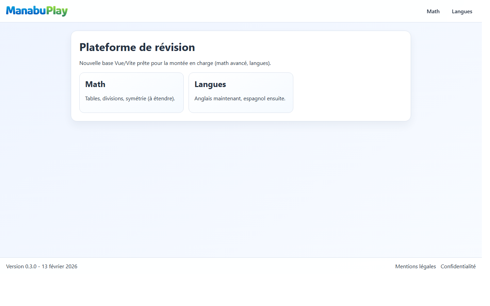
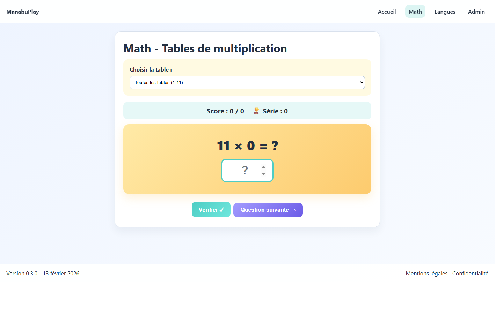
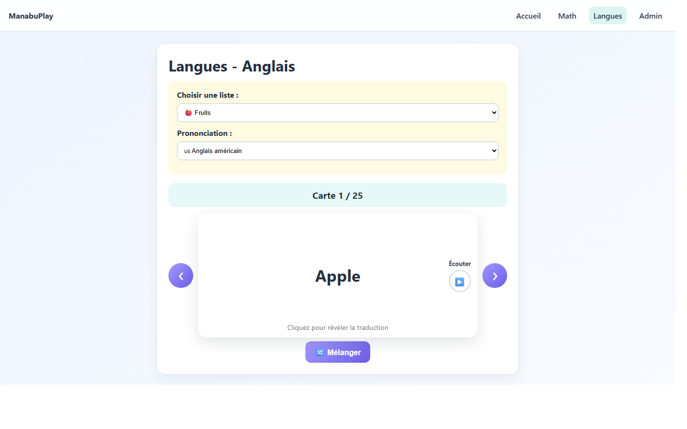

# ManabuPlay - GitHub Showcase

     [](https://app.netlify.com/projects/manabuplay/deploys)

ManabuPlay est une SPA éducative pour enfants (Vue 3 + Vite) orientée révision scolaire : maths, vocabulaire et panneau interne d’édition locale.

[📘 Documentation FR](docs/README.fr.md) | [📗 Documentation EN](docs/README.en.md)

## Demo rapide

- Local: `npm run dev`
- Build: `npm run build`
- Tests unitaires/intégration: `npm test`
- Tests E2E navigateur: `npm run test:e2e`
- QA release automatisée: `npm run qa:release`

## Points forts

- Module **Math**: quiz tables de multiplication (0-11 + mode toutes tables), meilleure série locale
- Module **Langues**: flashcards anglais multi-listes, TTS US/UK, vitesse de lecture (3 niveaux), sens de carte EN/FR ou FR/EN
- **Zone interne V1**: édition locale des listes JSON (accès restreint, front-only)
- Source de vérité vocabulaire: JSON externes (`src/content/vocab/en`)

## Captures

### Accueil


### Module Math


### Module Vocab


## Stack

- Vue 3
- Vue Router
- Vite
- Vitest
- Playwright

## Structure

```text
manabuplay/
  src/
  public/
  docs/
  tests/e2e/
```

## Protection Zone Interne

- Accès interne protégé par identifiant + mot de passe (hash côté front).
- Variables `.env`: `VITE_ADMIN_USERNAME`, `VITE_ADMIN_PASSWORD_HASH`, `VITE_ADMIN_MAX_ATTEMPTS`, `VITE_ADMIN_BLOCK_MS`, `VITE_ADMIN_HARD_BLOCK_MS`, `VITE_ADMIN_SESSION_TTL_MS`.
- URL interne: non exposée dans le menu (route privée).
- Mode front-only: protection légère, non équivalente à une authentification serveur.

## Documentation

- README principal: `README.md`
- Documentation FR détaillée: `docs/README.fr.md`
- Documentation EN détaillée: `docs/README.en.md`
- Checklist release hebdo: `docs/RELEASE-CHECKLIST.fr.md`
- Checklist QA v2: `docs/QA-CHECKLIST.fr.md`
- Sécurité secrets (ggshield): `docs/SECURITY-SECRETS.fr.md`
- Git cheat sheet: `docs/GIT-CHEATSHEET.fr.md`
- Guide panel interne (FR): `docs/PANEL-INTERNE.fr.md`
- Internal panel guide (EN): `docs/PANEL-INTERNE.en.md`
- Charte UI/UX (FR): `docs/UI-RULES.fr.md`

## Sécurité secrets

- Scan GitGuardian activé en CI via `.github/workflows/ggshield.yml`.
- Hook local ggshield actif pour bloquer les secrets avant commit.
- Ajouter le secret GitHub `GITGUARDIAN_API_KEY` pour activer le scan CI.

## Version

- Version en cours: `0.5.0-prep`
- Dernière modification: `22 février 2026` (fr-FR)

